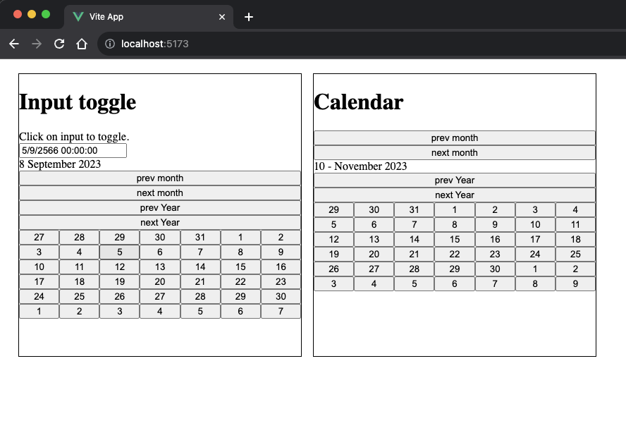

# normal-calendar |

Normal calendar is a Vue library with zero dependencies, providing a minimalistic calendar implementation in a 6x7 grid format without a predefined template.

## Table of Contents
1. [Installation](#installation)
2. [Usage](#usage)
3. [Interfaces](#interfaces)
4. [Examples](#examples)


#Installation 
```shell
 npm install normal-calendar
```


#Usage
``` js
 import { Calendar, type Day } from "normal-calendar";

<Calendar #default="{ calendar }" :init="{ toggle: true, day: new Date(2023, 10, 0) }">
</Calendar>

```


# Interfaces

This document outlines TypeScript interfaces used in the calendar component, their properties, and their purposes.

## CalendarInstance

The `CalendarInstance` interface represents the state of a calendar instance.

- `today: Date` - The current date.
- `initMonthYear: Date` - The initial month and year displayed in the calendar.
- `selectDate: Date` - The currently selected date.
- `toggle: () => void` - A function to toggle the calendar's visibility.
- `isOpenCalendar: () => boolean` - A function that returns `true` if the calendar is open and `false` otherwise.
- `days: Day[]` - An array of Day objects representing calendar days.
- `month: number` - The current month (0 to 11).
- `year: number` - The current year.
- `monthName: string` - The name of the current month.
- `trigger: Trigger` - An object with functions to navigate through months and years.


## CalendarOptions

The CalendarOptions interface defines options that can be passed when initializing a calendar instance.

- day?: Date - An optional date to set the calendar's initial date.
- toggle?: boolean - An optional boolean flag to specify whether the calendar should be initially open.
- `onGenerateDay?: (day: Day) => void` - An optional callback function to handle day generation.

## Trigger

The `Trigger` interface provides functions to navigate through months and years.

- `nextMonth: () => void` - Go to the next month.
- `nextYear: () => void` - Go to the next year.
- `prevMonth: () => void` - Go to the previous month.
- `prevYear: () => void` - Go to the previous year.

## Day

The `Day` interface represents a day in the calendar.

- `day: number` - The day of the month (1 to 31).
- `year: number` - The year.
- `month: number` - The month (1 to 12).

## Months Array


The `months` array provides the names of the months for use in the calendar.

```javascript
const months = [
  "January",
  "February",
  "March",
  "April",
  "May",
  "June",
  "July",
  "August",
  "September",
  "October",
  "November",
  "December",
];
```

#Examples

Use as date picker with input.

``` typescript

<script setup lang="ts">
import { Calendar, type Day } from "normal-calendar";
import { ref } from "vue";

const onSelectDay = (day: Day) => {
  pickDate.value = new Date(day.year, day.month, day.day).toLocaleString(
    "th-TH",
    { timeZone: "Asia/Jakarta" }
  );
};
</script>

<template>
<input type="text" @click="calendar.toggle" v-model="pickDate" />
<Calendar #default="{ calendar }">
        <div class="calendar-container">
          <input type="text" @click="calendar.toggle" v-model="pickDate" />
          <div v-if="calendar.isOpenCalendar()">
            <div class="head">
              <div>
                {{ calendar.month }} {{ calendar.monthName }}
                {{ calendar.year }}
              </div>
              <button @click="calendar.trigger.prevMonth()">prev month</button>
              <button @click="calendar.trigger.nextMonth()">next month</button>

              <button @click="calendar.trigger.prevYear()">prev Year</button>
              <button @click="calendar.trigger.nextYear()">next Year</button>
            </div>
            <div class="calendar">
              <template v-for="day of calendar.days">
                <button @click="onSelectDay(day)">{{ day.day }}</button>
              </template>
            </div>
          </div>
        </div>
</Calendar>
</template>
```


Use as calendar

``` typescript
<script setup lang="ts">
import { Calendar, type Day } from "normal-calendar";
import { ref } from "vue";
</script>

<template>
    <Calendar
        #default="{ calendar }"
        :init="{ toggle: true, day: new Date(2023, 10, 0) }"
      >
        <div class="calendar-container">
          <div v-if="calendar.isOpenCalendar()">
            <div class="head">
              <button @click="calendar.trigger.prevMonth()">prev month</button>
              <button @click="calendar.trigger.nextMonth()">next month</button>
              <div>
                {{ calendar.month }} - {{ calendar.monthName }}
                {{ calendar.year }}
              </div>
              <button @click="calendar.trigger.prevYear()">prev Year</button>
              <button @click="calendar.trigger.nextYear()">next Year</button>
            </div>
            <div class="calendar">
              <template v-for="day of calendar.days">
                <button>{{ day.day }}</button>
              </template>
            </div>
          </div>
        </div>
      </Calendar>
</template>
```



<h3 align="left">Support:</h3>

<p><a href="https://www.buymeacoffee.com/nawapbZ"> </a>
</p>